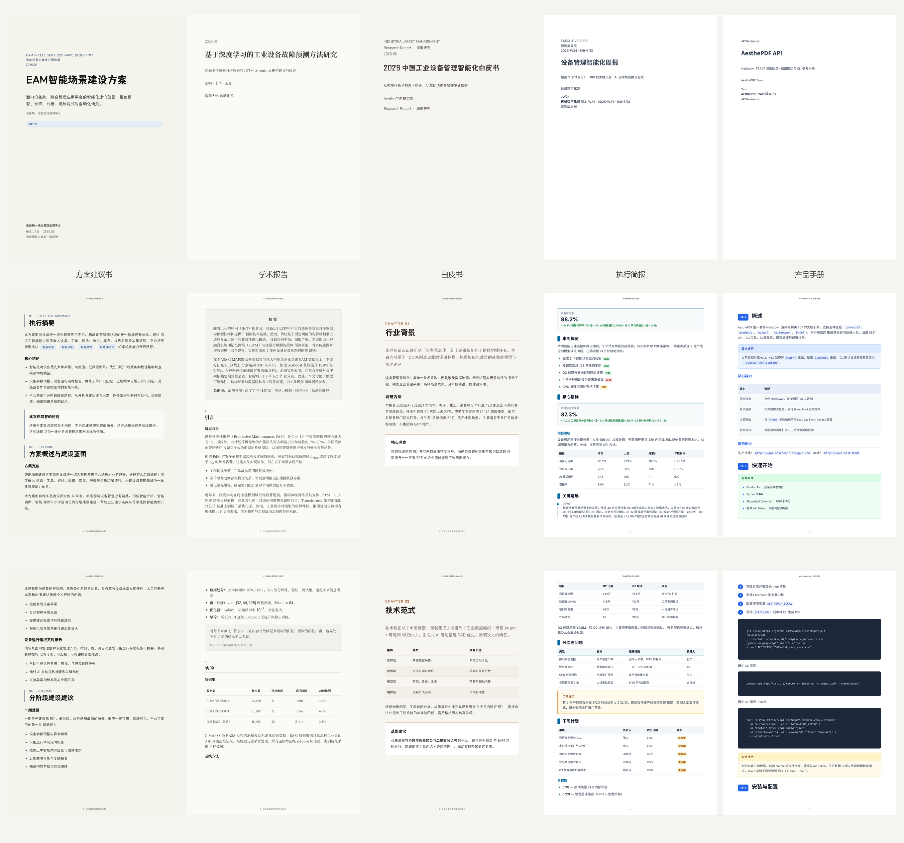

# AesthePDF

**Markdown → 精美 PDF** 的通用 **Agent Skill**。基于 Pandoc + Chromium 打印，提供五种专业文档版式，支持公式、代码高亮、KPI 卡片、编辑排版等组件，并可通过 **能力组合** 灵活处理混合体裁文档。适用于 Cursor、Claude Code、Windsurf、Codex 等支持 Skill 的 AI Agent。

MIT License · 适用于方案、论文、白皮书、简报、手册等场景

<p align="center">
  
</p>

---

## 特性

- **五种主题布局** — 不是换色，而是五种完全不同的文档体裁
- **Agent Skill 开箱即用** — 拷贝 `aesthepdf/` 到 Agent 的 skills 目录，用自然语言即可生成 PDF
- **能力可组合** — 主主题定体裁，代码高亮 / 公式等通过 frontmatter 叠加（见 [composition.md](aesthepdf/composition.md)）
- **自带字体** — 思源宋体/黑体、Inter、Source Sans 3 等，离线可渲染
- **封面 + 目录 + 页眉** — 按主题配置，支持 Playwright 分页打印

## 渲染管线

```
Markdown (.md) + theme.json
  → Pandoc（MathML / 语法高亮 / Lua 过滤器）
  → HTML + themes/<id>/style.css + assets/template.html
  → scripts/render.py（Chromium print）
  → PDF
```

## 主题一览

| ID | 名称 | 适用场景 | 独有能力 |
|----|------|----------|----------|
| `proposal` | 方案建议书 | 客户方案、建设蓝图、售前 | callout、tag、英中 label 章节 |
| `academic` | 学术报告 | 论文、实验报告、教程、学习指南 | MathML 公式、abstract、figure |
| `whitepaper` | 白皮书 | 行业研究、深度长文 | lead、stats、pullquote、insight |
| `brief` | 执行简报 | 周报、月报、管理层摘要 | KPI 卡片、timeline、action |
| `manual` | 产品手册 | API 文档、操作手册 | 语法高亮、api 块、admonition |

### 样例预览

仓库 `aesthepdf_output/` 内含五个主题的 **PDF + 源 Markdown**，可直接打开对比效果：

| 主题 | PDF | Markdown 源文件 |
|------|-----|-----------------|
| proposal | [proposal.pdf](aesthepdf_output/proposal.pdf) | [proposal.md](aesthepdf_output/proposal.md) |
| academic | [academic.pdf](aesthepdf_output/academic.pdf) | [academic.md](aesthepdf_output/academic.md) |
| whitepaper | [whitepaper.pdf](aesthepdf_output/whitepaper.pdf) | [whitepaper.md](aesthepdf_output/whitepaper.md) |
| brief | [brief.pdf](aesthepdf_output/brief.pdf) | [brief.md](aesthepdf_output/brief.md) |
| manual | [manual.pdf](aesthepdf_output/manual.pdf) | [manual.md](aesthepdf_output/manual.md) |

---

## 快速开始

### 环境要求

| 依赖 | 说明 |
|------|------|
| [Pandoc](https://pandoc.org/) 3.x | 必须在 PATH 中 |
| Python 3.10+ | 运行渲染脚本 |
| Chromium | 通过 Playwright 安装 |

```bash
# 克隆仓库
git clone https://github.com/<your-org>/AesthePDF.git
cd AesthePDF

# Python 依赖（在 aesthepdf 目录下执行）
pip install -r aesthepdf/scripts/requirements.txt
python -m playwright install chromium

# 验证
python aesthepdf/scripts/render.py --list-themes
```

### 命令行渲染

在 **skill 目录**（`aesthepdf/`）下执行，或使用绝对路径指向 `scripts/render.py`：

```bash
# 渲染学术报告样例
python aesthepdf/scripts/render.py aesthepdf_output/academic.md \
  -o aesthepdf_output/academic.pdf --theme academic

# 渲染方案建议书
python aesthepdf/scripts/render.py aesthepdf_output/proposal.md \
  -o aesthepdf_output/proposal.pdf --theme proposal
```

### CLI 参数

| 参数 | 说明 |
|------|------|
| `input.md` | 输入 Markdown |
| `-o, --output` | 输出 PDF 路径 |
| `--theme ID` | 主题（默认 `proposal`） |
| `--no-toc` | 跳过目录 |
| `--title TEXT` | 覆盖页眉/页脚文档标题 |
| `--list-themes` | 列出所有主题 |

---

## 作为 Agent Skill 使用

`aesthepdf/` **整个文件夹** 即为 Skill 产品（`SKILL.md` 说明 + 渲染脚本 + 主题 + 字体）。拷贝到任意支持 Skill 规范的 Agent 即可使用。

### 安装

将 `aesthepdf/` 拷贝到你所用 Agent 的 skills 目录，文件夹名保持 `aesthepdf`：

```text
# 示例：按你所用 Agent 的文档放置，常见路径包括——
~/.cursor/skills/aesthepdf/              # Cursor
~/.claude/skills/aesthepdf/              # Claude Code
~/.codex/skills/aesthepdf/               # Codex
~/.agent/skills/aesthepdf/               # 通用 Agent
<project>/.cursor/skills/aesthepdf/      # Cursor（项目级）
<project>/.claude/skills/aesthepdf/      # Claude Code（项目级）
<project>/.codex/skills/aesthepdf/       # Codex（项目级）
<project>/.agent/skills/aesthepdf/       # 通用 Agent（项目级）
```

也可直接 clone 本仓库，在对话中让 Agent 读取 `aesthepdf/SKILL.md` 并按其中流程执行。

### 使用

用自然语言向 Agent 描述需求，例如：

```text
使用 aesthepdf skill，帮我写一份 Transformer 原理学习与代码入手指南，输出 PDF。
```

Agent 应读取 `aesthepdf/SKILL.md` 并执行：

1. 选择 **主主题**（如 `academic`）
2. 扫描内容信号，**叠加能力**（如有代码块 → `code-highlight: true`）
3. 在 **`aesthepdf_output/`** 写入 `.md` 并调用 `scripts/render.py` 生成 `.pdf`
4. 返回 PDF 路径

完整工作流见 [aesthepdf/SKILL.md](aesthepdf/SKILL.md)。

### 输出目录约定

Agent 生成的文档统一放在项目根目录：

```text
<workspace-root>/aesthepdf_output/
├── my-report.md
└── my-report.pdf
```

不要将 `.md` / `.pdf` 散落在项目根目录或 skill 目录内。

---

## 能力组合（混合文档）

真实需求常为混合体裁，例如：**教程排版 + 语法高亮代码**、**白皮书 + 参考实现**。

**原则：主主题定体裁，次要能力用 frontmatter 叠加，不要为单一特征换掉整个主题。**

```yaml
---
theme: academic          # 主布局：学术报告
code-highlight: true     # 叠加：manual 级代码高亮
cover-title: Transformer 原理学习与代码入手指南
document-title: Transformer 学习与实战
lang: zh-CN
---
```

| 需求 | Frontmatter |
|------|-------------|
| 语法高亮代码（任意主主题） | `code-highlight: true` |
| 自定义 Pygments 样式 | `syntax-highlighting: breezeDark` |
| 跳过封面 | `cover: false` |

完整决策树、混合模式与反模式：[aesthepdf/composition.md](aesthepdf/composition.md)

---

## Markdown 写作要点

### 章节标题（目录必需）

```markdown
## 引言 {.section-header label="1"}
```

所有 `##` 章节须带 `.section-header`，否则目录为空。

### 主题组件示例

**Proposal — callout + tag**

```markdown
从 [智能问答]{.tag} [智能分析]{.tag} 到自动化

::: callout
### 核心结论
- 优先落地高频场景
:::
```

**Academic — 摘要 + 公式**

```markdown
::: abstract
## 摘要
本文研究了……
:::

行内公式 $E=mc^2$，块级公式：

$$
\int_0^1 x\, dx = \frac{1}{2}
$$
```

**Brief — KPI + 时间线**

```markdown
::: kpis
可用率|98%|↑ 0.3%
闭环率|76%|↓ 4%
:::

::: timeline
06-09|场景上线灰度
06-11|UAT 通过
:::
```

更多片段见 [aesthepdf/examples.md](aesthepdf/examples.md)。

---

## 项目结构

```text
AesthePDF/
├── README.md                 # 本文件
├── LICENSE                   # MIT
├── images/                   # README 预览拼图（由 scripts/gen_readme_images.py 生成）
│   └── preview-grid.png      # 3×5 主题预览
├── scripts/
│   └── gen_readme_images.py  # 从 aesthepdf_output/*.pdf 生成预览图
├── aesthepdf/                # ★ Skill 产品本体（拷贝此目录安装）
│   ├── SKILL.md              # Agent 指令
│   ├── composition.md        # 混合文档能力组合规则
│   ├── examples.md           # Markdown 片段
│   ├── reference.md          # Proposal 设计参考
│   ├── scripts/
│   │   ├── render.py         # 渲染入口
│   │   └── requirements.txt
│   ├── themes/               # 五套主题 theme.json + style.css
│   ├── assets/               # base.css, code-blocks.css, template.html, filters/
│   ├── fonts/                #  bundled 字体
│   └── templates/            # 各主题完整样例 .md
├── aesthepdf_output/         # 五主题 PDF + 源 Markdown（可提交、可预览）
└── doc/                      # 本地设计参考（gitignore）
```

---

## 自定义主题

每个主题位于 `aesthepdf/themes/<id>/`：

```text
themes/academic/
├── theme.json    # Pandoc 扩展、math/highlight、Lua 过滤器、defaults
└── style.css     # 版式与组件样式
```

| 修改目标 | 文件 |
|----------|------|
| 颜色、间距、封面 | `themes/<id>/style.css` |
| 公式/高亮/过滤器 | `themes/<id>/theme.json` |
| 共享表格、目录 | `assets/base.css` |
| 代码块样式 | `assets/code-blocks.css` |
| 封面/目录 HTML 壳 | `assets/template.html` |
| 打印页边距 | `scripts/render.py` |

修改后重新运行 `render.py` 验证，**不要**直接编辑 PDF。

---

## 常见问题

| 问题 | 处理 |
|------|------|
| `pandoc not found` | 安装 Pandoc 3.x 并加入 PATH |
| Playwright 报错 | `pip install -r aesthepdf/scripts/requirements.txt` 且 `python -m playwright install chromium` |
| 目录为空 | 章节须使用 `## … {.section-header}` |
| 代码块无高亮 | 非 `manual` 主题时加 `code-highlight: true` |
| 混合体裁选错主题 | 阅读 [composition.md](aesthepdf/composition.md)，主主题 + 叠加能力 |
| 字体乱码 | 确保 `aesthepdf/fonts/` 完整，勿单独拷贝 SKILL.md |

---

## 参与与许可

- **License**: [MIT](LICENSE) · Copyright (c) 2026 Techd
- Issue / PR 欢迎提交主题改进、样例扩充与文档修正
- Skill 文档入口：[aesthepdf/SKILL.md](aesthepdf/SKILL.md)

---

<p align="center">
  <sub>Write Markdown · Pick a theme · Print a beautiful PDF</sub>
</p>
